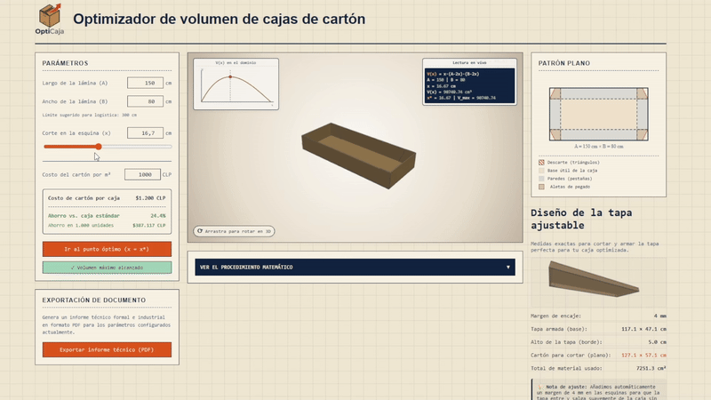

# OptiCaja

Packaging optimization tool that calculates the mathematically optimal corner cutout for raw cardboard sheet dimensions to maximize container volume. Includes procedural 3D rendering with Three.js, interactive 2D cutting patterns, and client-side PDF export.

<br>

<p align="center">
  <a href="https://opticaja.daemonize.me" target="_blank" rel="noopener noreferrer">
    
  </a>
</p>

<br>

<p align="center">
  
</p>

## Mathematical Formulation

Given a flat rectangular sheet of length $A$ and width $B$, cutting square corners of size $x$ and folding the sides yields an open-top box with dimensions $(A - 2x) \times (B - 2x) \times x$.

### Volume Function
$$V(x) = x(A - 2x)(B - 2x) = 4x^3 - 2(A + B)x^2 + ABx$$

### Critical Points (First Derivative)
Setting the first derivative to zero:
$$V'(x) = 12x^2 - 4(A + B)x + AB = 0$$

Solving for the physical domain ($0 < x < \min(A, B) / 2$):
$$x^* = \frac{(A + B) - \sqrt{A^2 - AB + B^2}}{6}$$

### Second Derivative Test
To confirm a local maximum:
$$V''(x) = 24x - 4(A + B) < 0$$

The application computes this critical point in real time upon input changes, calculating optimal volume, surface scrap percentage, and material savings.

## Key Features

- **Procedural 3D Viewport (Three.js)**: Models the base box, trapezoidal gluing flaps, and a matching telescoping lid with automated clearance (+4 mm) and bounded height (<= 5 cm).
- **Interactive 2D SVG Die-cut Pattern**: Color-coded flat pattern displaying base area, wall folds, flap geometry, and corner cutouts.
- **Volume Curve Visualization**: Interactive SVG chart mapping $V(x)$ across the valid physical range with real-time cursor tracking.
- **Client-Side PDF Generation**: Exports technical manufacturing sheets using `jsPDF` and `jsPDF-AutoTable` entirely in-browser without server dependencies.

## Tech Stack

- **Framework**: React 19, Vite 8
- **3D Graphics**: Three.js (r185)
- **Document Generation**: jsPDF, jsPDF-AutoTable
- **Styling**: Vanilla CSS / Responsive Grid
- **Deployment**: Docker (Nginx alpine multi-stage build)

## Project Structure

```
opticaja/
├── src/
│   ├── componentes/
│   │   ├── Visor3D.jsx           # Three.js scene, lighting, procedural meshes
│   │   ├── PatronPlano.jsx       # 2D SVG die-cut diagram
│   │   ├── GraficoVolumen.jsx    # SVG polynomial curve rendering
│   │   ├── ExportarInforme.jsx   # jsPDF document generation
│   │   ├── PanelProcedimiento.jsx# Step-by-step calculus breakdown
│   │   ├── PanelTapa.jsx         # Telescopic lid dimension panel
│   │   └── Controles.jsx         # Sheet dimension inputs and sliders
│   ├── contexto/
│   │   └── ContextoCaja.jsx      # Global state for sheet dimensions
│   ├── matematica/
│   │   └── modeloCaja.js         # Calculus, critical points, and validation
│   ├── App.jsx
│   └── main.jsx
├── nginx.conf                    # SPA routing and cache headers
├── Dockerfile                    # Multi-stage Node -> Nginx container
└── docker-compose.yml
```

## Local Setup

### Prerequisites
- Node.js 18+ and npm (or Docker)

### Running Locally

```bash
# Clone the repository
git clone https://github.com/daemon1s/opticaja-react-threejs.git
cd opticaja-react-threejs

# Install dependencies
npm install

# Start development server
npm run dev
```

### Running with Docker

```bash
docker compose up -d --build
```
The application will be available at `http://localhost:8080`.
